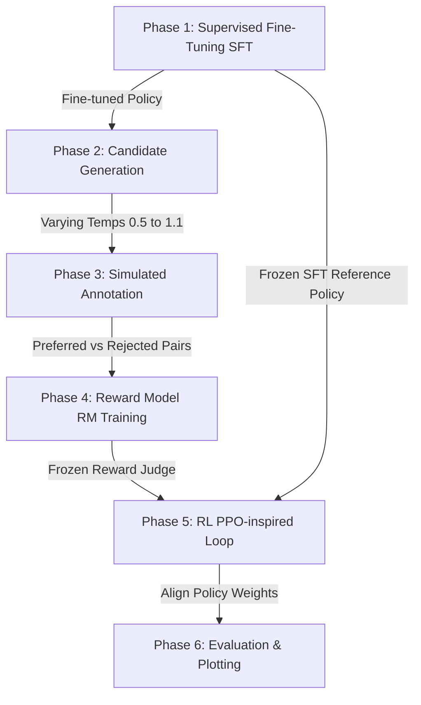

# 🚀 Mini-Transformer RLHF Pipeline V2 (Full Methodology)

A from-scratch, single-file implementation of a **Causal Decoder-Only Transformer (GPT-style)** with a complete **Reinforcement Learning from Human Feedback (RLHF)** alignment loop in pure PyTorch.

This project is designed as an educational bridge between abstract Reinforcement Learning (RL) theory and production-grade LLM alignment methodologies. It implements all core phases of alignment—including Supervised Fine-Tuning, Reward Modeling, and policy optimization via Reinforcement Learning with KL-divergence regularization—without the complexity of heavy external frameworks.

---

## 📊 The Alignment Pipeline Flow

This codebase operates across six distinct phases, mirroring the exact methodology used to align state-of-the-art LLMs:



---

## 🛠️ Step-by-Step Architectural Mechanics

### 1. The Core Architecture
*   **Backbone:** A custom GPT-style decoder-only transformer with learned positional embeddings.
*   **Modern Design:** Built with standard **Pre-LayerNorm** blocks (LayerNorm before multi-head attention and feed-forward networks) to ensure gradient stability, and **weight tying** between token embeddings and the language modeling head.
*   **Self-Contained Tokenizer:** Implements a custom printable-character-level tokenizer (`CharTokeniser`) to keep the codebase fully zero-dependency.

### 2. The 6-Phase Pipeline
*   **Phase 1: Supervised Fine-Tuning (SFT)**  
    Trains the model on a dataset of 50+ diverse recipe-to-summary pairs using standard teacher-forced Cross-Entropy loss. This establishes basic grammar, syntax, and instruction-following capability.
*   **Phase 2: Candidate Generation**  
    Generates $4$ distinct summary completions per recipe from the SFT model, sampled at temperatures ranging from $0.5$ (conservative) to $1.1$ (creative).
*   **Phase 3: Preference Annotation (Simulated Human Feedback)**  
    Scores the generated completions using a heuristic scoring function that mimics human preferences based on content overlap, target length constraints, recipe ingredient coverage, and penalties for repetitive/garbled outputs. The best and worst summaries are stored as pairwise comparisons.
*   **Phase 4: Reward Model (RM) Training**  
    Clones the transformer backbone and swaps the vocabulary projection head with a scalar projection head mapping to a single score. The RM is trained on the pairwise preferences using **Bradley-Terry comparison loss**:
    $$\mathcal{L}_{RM} = -\log \sigma \left( r(x, y_{\text{preferred}}) - r(x, y_{\text{rejected}}) \right)$$
*   **Phase 5: PPO-Inspired RL Fine-Tuning**  
    Clones the SFT model into an active `policy_model` and a frozen `ref_model` (reference policy). The policy generates completions, gets evaluated by the frozen Reward Model, and is optimized using policy gradients (REINFORCE). 
    
    To prevent **reward hacking** (where the model discovers a garbled sequence that scores highly but is unreadable), a token-level **KL Divergence Penalty** is computed between the policy and reference distributions and added to the loss:
    $$\text{advantage} = r - \beta \cdot D_{\text{KL}}(\pi_\theta \,\|\, \pi_{\text{ref}})$$
*   **Phase 6: Evaluation & Visualization**  
    Evaluates SFT vs. RL-tuned models side-by-side on held-out test recipes, scores them with the Reward Model, and uses `matplotlib` to plot training metrics over epochs.

---

## 🎯 Why This Project is Highly Helpful

1.  **Demystifies the "Black Box" of RLHF:** Real-world RLHF (such as Anthropic's Constitutional AI or OpenAI's InstructGPT) runs across complex, distributed GPU clusters. This codebase packs the *entire mathematical workflow*—including comparison losses, sequence log-probabilities, advantages, and KL-divergence penalties—into a highly commented, single-file script.
2.  **Teaches Real Generation Alignment:** Many simple tutorials train reward models on fixed, gold-standard human datasets. This project generates **actual, real-time completions from the active model** during training. This mimics real-world feedback loops where reward models learn to correct actual agent output.
3.  **Visual Proof of Concept:** If `matplotlib` is installed, the training script automatically saves 6 metric curves showing cross-entropy loss, comparison loss, reward growth, policy loss, and KL divergence stabilization.

---

## ⚡ Quick Start

### 1. Prerequisites
Ensure you have PyTorch and Matplotlib installed:
```bash
pip install torch matplotlib
```

### 2. Run the Pipeline
Simply execute the Python script to run SFT, candidate generation, preference annotation, reward model training, and reinforcement learning:
```bash
python mini_transformer_rlhf_v2.py
```

### 3. Review the Outputs
The script will output a clean console table comparing SFT vs. RL side-by-side. 
Additionally, all training metrics will be plotted and saved in the automatically created `./rlhf_outputs/` directory:
*   `rlhf_outputs/training_curves.png` (Comprehensive 2x3 summary chart)
*   `rlhf_outputs/sft_loss.png`
*   `rlhf_outputs/rm_loss.png`
*   `rlhf_outputs/rl_rewards.png`

---

## 🔬 Architectural Summary

| Parameter | Value | Description |
| :--- | :--- | :--- |
| **`d_model`** | 128 | Transformer hidden dimension size |
| **`n_heads`** | 4 | Attention heads |
| **`n_layers`** | 3 | Transformer block layers |
| **`d_ff`** | 256 | Feed-forward dimension |
| **`max_seq_len`** | 160 | Max sequence length |
| **`KL_beta`** | 0.15 | Regularization coefficient for $D_{\text{KL}}$ |

---

## 📜 License
This project is open-source and available under the [MIT License](LICENSE).
